# Student-Management-System-Using-Django
This is a Management system for students of the College of Rural Development.
## Features of this Project

### I. Admin Users Can
1. See Overall Summary Charts of Students Performances, Staff Performances, Courses, Subjects, Leave, etc.
2. Manage Teachers (Add or Upload from CSV file, Update and Delete)
3. Manage Students (Add or Upload from CSV file, Update and Delete)
4. Manage Department (Add, Update and Delete)
5. Manage Major (Add, Update and Delete)
6. Manage Class (Add, Update and Delete)
7. Manage Subjects (Add, Update and Delete)
8. Manage Sessions (Add, Update and Delete)
9. Manage Assign (Add, Update and Delete)
10. View Student Attendance
11. Review and Reply Student/Staff Feedback
12. Review (Approve/Reject) Student/Staff Leave

### II. Teachers Can
1. See the Overall Summary Charts related to their students, their subjects, leave status, etc.
2. Take/Update Students Attendance
3. Add/Update Result
4. Apply for Leave
5. Send Feedback to Trainning Department

### III. Students Can
1. See the Overall Summary Charts related to their attendance, their subjects, leave status, etc.
2. View Attendance
3. View Result
4. View Fee Information
5. Apply for Leave
6. Send Feedback to Trainning Department


## ScreenShots

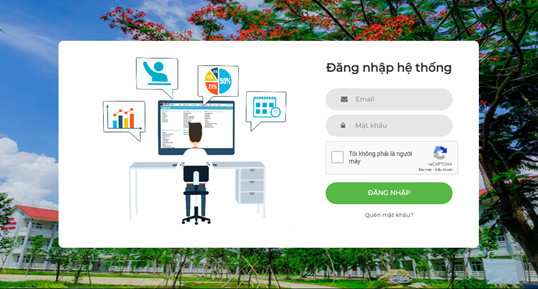

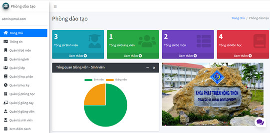

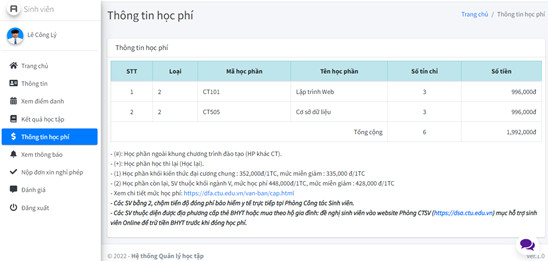


| Admin| Teacher| Student |
|------|-------|---------|
|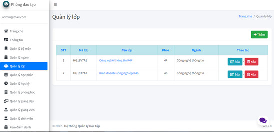|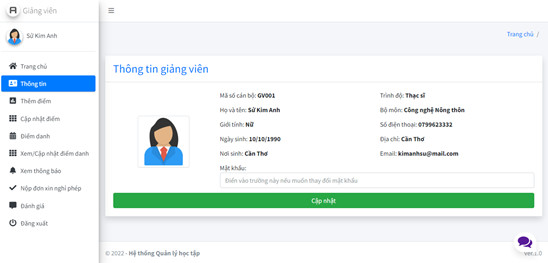||
|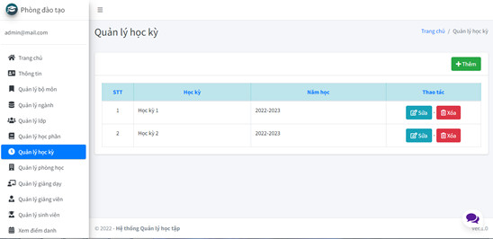|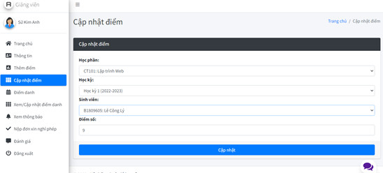|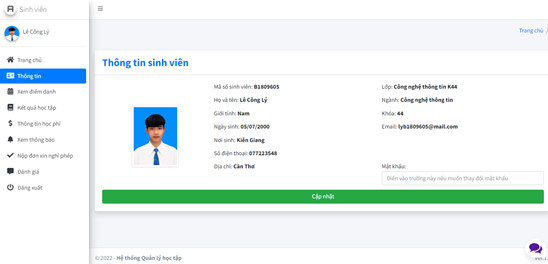|
|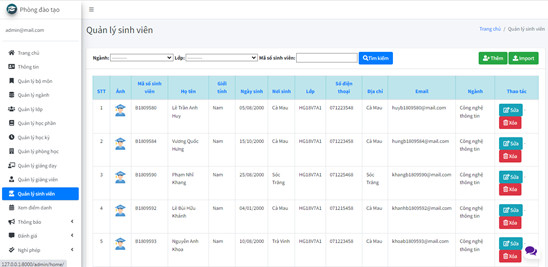|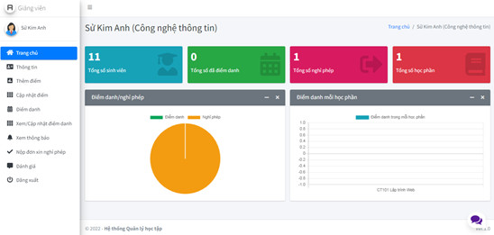|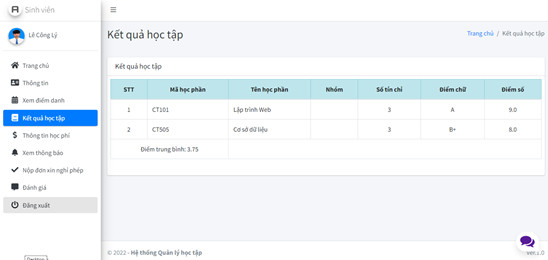|
|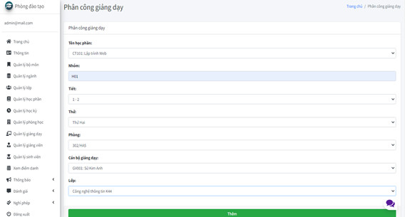|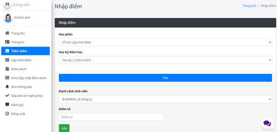|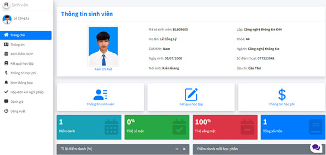|
|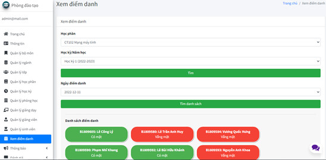|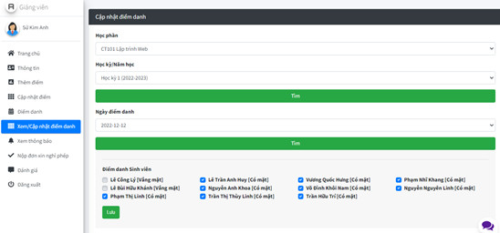|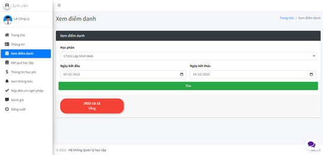|
|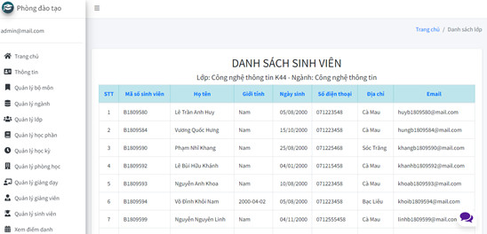|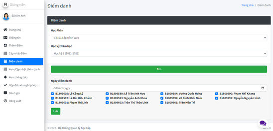|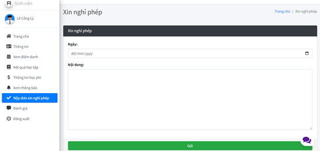|
|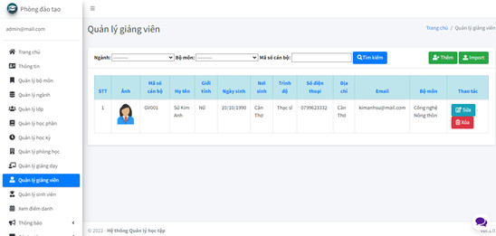|

## Install and Run this project

### Pre-Requisites:
1. Install Git Version Control
[ https://git-scm.com/ ]

2. Install Python Latest Version
[ https://www.python.org/downloads/ ]

3. Install Pip (Package Manager)
[ https://pip.pypa.io/en/stable/installing/ ]

*Alternative to Pip is Homebrew*

### Installation
**1. Create a Folder where you want to save the project**

**2. Create a Virtual Environment and Activate**

Install Virtual Environment First
```
$  pip install virtualenv
```

Create Virtual Environment

For Windows
```
$  python -m venv venv
```
For Mac
```
$  python3 -m venv venv
```
For Linux
```
$  virtualenv .
```

Activate Virtual Environment

For Windows
```
$  source venv/scripts/activate
```

For Mac
```
$  source venv/bin/activate
```

For Linux
```
$  source bin/activate
```

**3. Clone this project**
```
$  git clone https://github.com/CongLy-Dev/Student-Management-System-Using-Django.git
```

Then, Enter the project
```
$  cd Student-Management-System-Using-Django
```

**4. Install Requirements from 'requirements.txt'**
```python
$  pip3 install -r requirements.txt
```

**5. Add the hosts**

- Got to settings.py file 
- Then, On allowed hosts, Use **[]** as your host. 
```python
ALLOWED_HOSTS = []
```
*Do not use the fault allowed settings in this repo. It has security risk!*


**6. Now Run Server**

Command for PC:
```python
$ python manage.py runserver
```

Command for Mac:
```python
$ python3 manage.py runserver
```

Command for Linux:
```python
$ python3 manage.py runserver
```

**7. Login Credentials**

Create Super User (HOD)
Command for PC:
```
$  python manage.py createsuperuser
```

Command for Mac:
```
$  python3 manage.py createsuperuser
```

Command for Linux:
```
$  python3 manage.py createsuperuser
```


Then Add Email and Password


